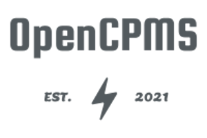

 

With OpenCPMS we aim to provide a free, open, modern, lightweight and extendable charge point management solution.

We iterate fast whereby we want to start with a working system right from the get go. To facilitate this, we start out
as a fork of the incredible project [SteVe](https://github.com/RWTH-i5-IDSG/steve).

Stay tuned
